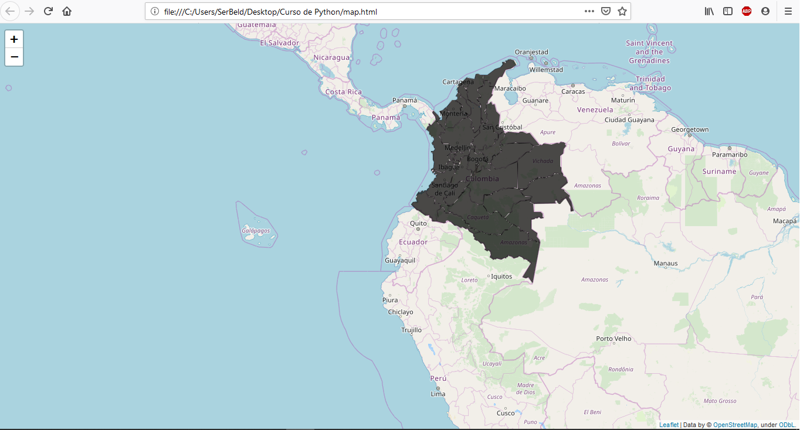

# Cartografía
Este repositorio está orientado a realizar prácticas de Cartografía 

# 

#### Imagen tomada por el Autor...

# Como descargar las librerías necesarias para compilar el código
Copie y pegue cada una de los siguientes comandos en el CMD (Símbolo del sistema) ingresando los comandos línea por línea solo una a la vez:

python -m pip install -U pip

python -m pip install --upgrade pip

pip install pandas

pip install folium

# Descargar OpenCV en Ubuntu
Copie y pegue cada una de los siguientes comandos en el terminal ingresando los comandos línea por línea solo una a la vez:

### Python 2

sudo apt-get install python-pip

python -m pip install --upgrade pip

pip install --user pandas

pip install --user folium

### Python 3

sudo apt-get install python3-pip

pip3 install --user pandas

pip3 install --user folium

####  

#### Autor: Sergio Beleño :octocat: ✒️
